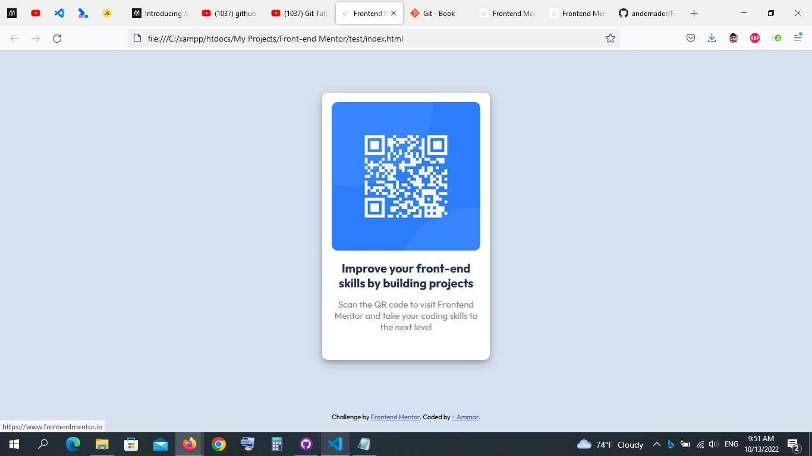

# Frontend Mentor - QR code component solution

This is a solution to the [QR code component challenge on Frontend Mentor](https://www.frontendmentor.io/challenges/qr-code-component-iux_sIO_H). 

## Welcome! 👋

This is my solution for the QR code component challenge 
I add some extra hover effects, and used some variable values on the way inside the :root !
